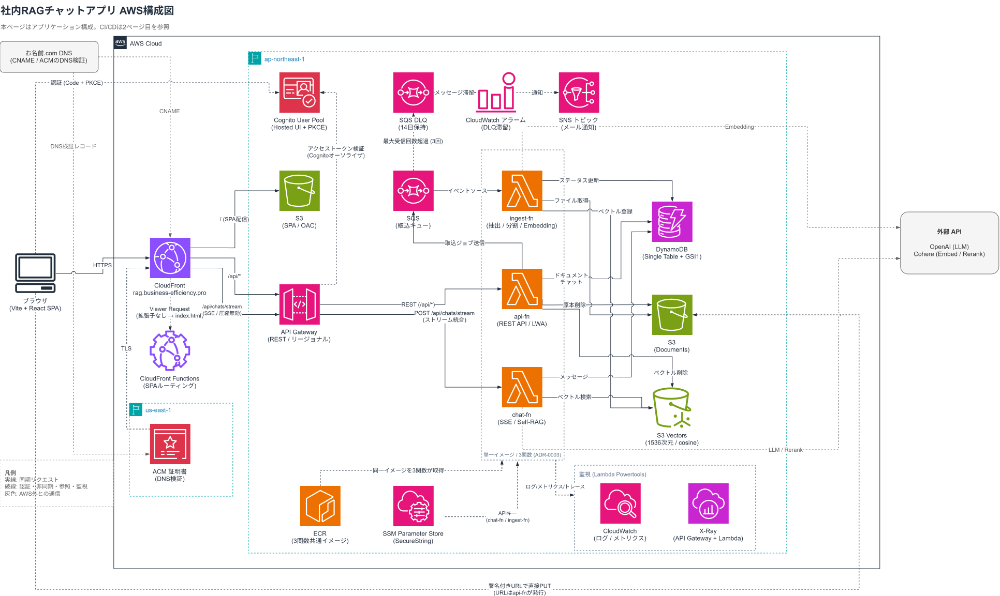
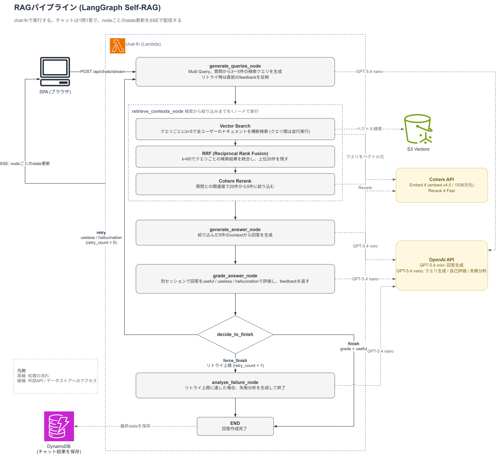
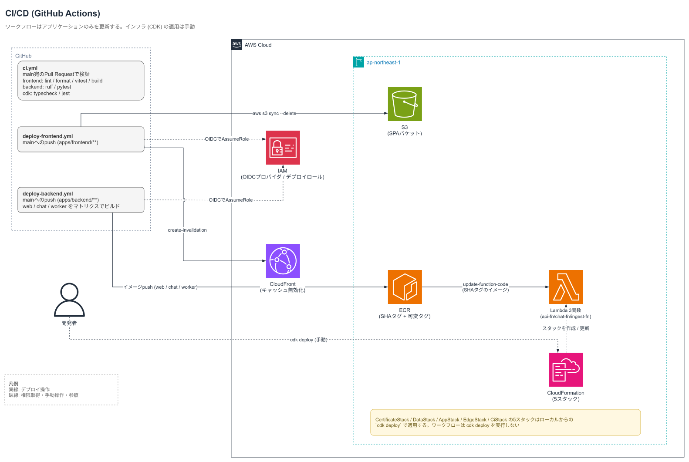

# 社内RAGチャットアプリ

社内ドキュメントを横断検索し、根拠となるドキュメントを添えて回答するRAGチャットアプリ。AWSのサーバーレスサービスのみで構成し、固定費を回避して運用する。

## デモ

## 背景と目的

手順書や過去の案件資料といったプロジェクト固有のドキュメントは、蓄積が進むほど保管場所が分散し、どこに何があるかを把握しづらくなる。仮に在り処が分かっても、情報量が多ければ必要な情報を取得するのに時間が掛かる。

本アプリは、社内ドキュメントを対象としたRAGチャットにより、必要な情報に早くアクセスすることを目的とする。回答の根拠となったドキュメントはユーザーが確認できる。チャット履歴も全ユーザーへ公開し、一度得られた回答をナレッジとして共有する。

## アーキテクチャ



ブラウザからの経路は、Cognito Hosted UIでの認証、CloudFront経由の画面表示とAPI呼び出し、署名付きURLによるS3への直接アップロードの3つに分かれる。`/api/*`はAPI Gatewayへ転送し、Cognitoオーソライザがアクセストークンを検証したうえでLambdaへ渡す。

バックエンドはFastAPIの単一コードベースを1つのDockerfileでビルドし、責務ごとに3つのLambdaへデプロイする。

| Function | 責務 | 実行構成 |
|---|---|---|
| api-fn | REST API(一覧・詳細・署名付きURL発行・取込開始) | Lambda Web Adapter / 512MB / 30秒 |
| chat-fn | LangGraphによるSelf-RAGの実行とSSE配信 | Lambda Web Adapter(ストリーミング) / 1024MB / 300秒 |
| ingest-fn | テキスト抽出・チャンク分割・Embedding・S3 Vectors登録 | SQSトリガー / 1024MB / 600秒 |

アップロードと取込は分離している。ファイルはLambdaを経由せずS3へ直接PUTし、Embedding生成はユーザーが取込を実行したときにSQS経由で開始する。ドキュメントのステータスは`uploading → uploaded → processing → ingested | failed`と遷移する。

回答生成はSelf-RAGで行う。Multi Query、ベクトル検索、RRFによる統合、Cohere Rerank、回答生成、自己評価、最大1回のリトライという流れをLangGraphで構成している。





CI/CDはGitHub Actionsで構成し、AWSへの認証はOIDCで行い、長期アクセスキーを持たせない。プルリクエストではlintとテストのみを実行し、`main`へのマージでフロントエンドのS3同期とバックエンドのECRプッシュ・Lambda更新を行う。インフラの変更はワークフローに含めず、`cdk deploy`を手元から実行する。

構成の詳細は[システム設計書](./docs/architecture.md)に記載する。

## 技術スタック

| 領域 | 採用技術 |
|---|---|
| フロントエンド | Vite / React 19 / TypeScript / React Router / TanStack Query / axios / oidc-client-ts |
| バックエンド | Python 3.12 / FastAPI / LangGraph / LangChain / uv |
| インフラ | AWS CDK(TypeScript) / Lambda(arm64・コンテナイメージ) / API Gateway / CloudFront / S3 / S3 Vectors / DynamoDB / SQS / Cognito / SSM Parameter Store / ECR |
| モデル | OpenAI GPT-5.4 mini・nano / Cohere Embed 4 / Cohere Rerank 4 Fast |
| 監視 | Lambda Powertools(Logger / Metrics / Tracer) / CloudWatch / X-Ray / SNS |
| CI/CD | GitHub Actions(OIDC) |
| テスト | Vitest + Testing Library / pytest + moto / Jest(CDKスナップショット) |

## 設計上の判断(ADR)

主要な判断は次のとおり。全14件は[docs/adr/](./docs/adr/)にある。

| ADR | 判断と理由 |
|---|---|
| [0001 サーバーレス構成による固定費回避方針](./docs/adr/0001-serverless-zero-fixed-cost.md) | 常駐リソースを持たずサーバーレスのみで構成する。損益分岐点を下回る利用量ではアイドル時間が支配的であり、常駐分がそのまま無駄になるため |
| [0003 単一のDockerfileから責務別に3つのLambdaをビルドする](./docs/adr/0003-single-dockerfile-three-lambdas.md) | ビルダーを共有したまま最終ステージを3ターゲットへ分ける。importの重いLangChain系をchat-fnのイメージに閉じ込め、他のFunctionのコールドスタートを守る |
| [0005 ベクトルDBにS3 Vectorsを採用](./docs/adr/0005-s3-vectors.md) | Chromaは常駐プロセスと永続ストレージを前提とし、VPC不使用の構成に載らない。S3 Vectorsは従量課金のみで固定費が発生しない |
| [0006 永続化先にDynamoDBを採用し、シングルテーブルで設計する](./docs/adr/0006-dynamodb-single-table.md) | GSI1のソートキーをULIDのID自体にして、横断一覧とID単独の取得を1つのGSIで賄う |
| [0007 署名付きURLによる直接アップロードと取込の分離](./docs/adr/0007-upload-ingest-separation.md) | 署名付きURLでS3へ直接PUTし、Embedding生成はユーザーの取込アクションで開始する。6MBの上限を回避し、誤アップロードにAPI費用をかけない |
| [0011 api-fnとchat-fnの公開経路をAPI Gatewayへ移行する](./docs/adr/0011-api-gateway-migration.md) | Cognitoオーソライザが統合の呼び出し前にJWTを検証するため、無効なトークンのリクエストがLambdaの実行回数を消費しない |
| [0012 チャットのSSEをPOSTとAuthorizationヘッダーで配信する](./docs/adr/0012-sse-post-with-authorization-header.md) | EventSourceはヘッダーを付けられずトークンがURLに残る。fetchでレスポンスを読み進め、認証方式を他のRESTと揃える |

## 移植元構成からの変更

本アプリは、同じRAG機能をVPC・ECS Fargate・RDS MySQLの常駐構成で実装した移植元アプリを、サーバーレスへ載せ替えたものである。

| 対象 | 移植元 | 本アプリ |
|---|---|---|
| 実行基盤 | ECS Fargate Spot(VPC内、平日9時から19時に稼働) | Lambda(VPC不使用) |
| ベクトルDB | Chroma on EFS | S3 Vectors |
| チャット永続化 | RDS MySQL | DynamoDB(シングルテーブル) |
| ユーザー識別 | X-User-Idヘッダ | CognitoのJWTの`sub` |

常駐構成は利用のない時間帯にも課金が続く一方、Lambdaの費用は実行時間に比例して増える。両者の損益分岐点は月間ストリーミング時間で722時間、1チャット30秒として約86,600チャットにあたり、移植元アプリ側の仮定を最も保守的に置いても約64,000チャット/月を下回らない。本アプリは、この下限である約64,000チャット/月を下回る利用量を前提としている。

費用モデルと導出は[コストモデルと損益分岐点](./docs/cost-comparison.md)に記載する。

## ローカル実行

```bash
make install   # npm install(frontend) + uv sync(backend)
make dev       # frontend :5173 と backend :8000 を同時に起動
```

Vite dev serverが`/api`を`localhost:8000`へプロキシするため、開発時も本番と同じ同一オリジン構成になる。

フロントエンドはCognitoの設定値をビルド時に埋め込む。`apps/frontend/.env.example`を`.env.local`へコピーし、DataStackの出力値を設定する。

バックエンドはデプロイ済みのAWSリソースを直接参照する。`/api/health`以外のエンドポイントには、`TABLE_NAME`、`DOCUMENTS_BUCKET_NAME`、`INGEST_QUEUE_URL`、`VECTOR_INDEX_ARN`、`COGNITO_ISSUER`、`COGNITO_CLIENT_ID`などの環境変数とAWS認証情報が必要になる。

```bash
make lint      # eslint + prettier / ruff
make test      # vitest + pytest
```

テストはmotoでAWSのAPIを差し替えるため、認証情報のない環境でも実行できる。CDKのテストは`cd cdk && npm test`で実行する。

デプロイの前提となるSSM SecureStringの手動作成やACM証明書の発行手順は[cdk/README.md](./cdk/README.md)にまとめている。

## リポジトリ構成

```text
apps/
  frontend/           Vite + React SPA
  backend/            FastAPI。3つのLambdaが共有する単一コードベース
cdk/                  CDK。CertificateStack / DataStack / AppStack / EdgeStack / CiStack
docs/
  architecture.md     システム設計書
  adr/                アーキテクチャ決定記録
  cost-comparison.md  移植元構成との損益分岐点
  diagrams/           構成図と生成スクリプト
.github/workflows/    PR検証とデプロイ
```

## 今後の課題

**1. 1つのチャットで複数回の質問を続けられるようにする**

現在は1問1答で、各質問を独立して処理している。生成された回答に対してさらに質問を重ねられるよう、履歴を文脈として扱う仕組みを追加する。

**2. Text-to-SQLによる付加価値の追加**

SQLに精通していないユーザーでも必要な情報にアクセスできるよう、Text-to-SQLを追加する。接続先は既存のDBサーバー、またはAurora DSQLやAurora Serverless v2を候補とする。
