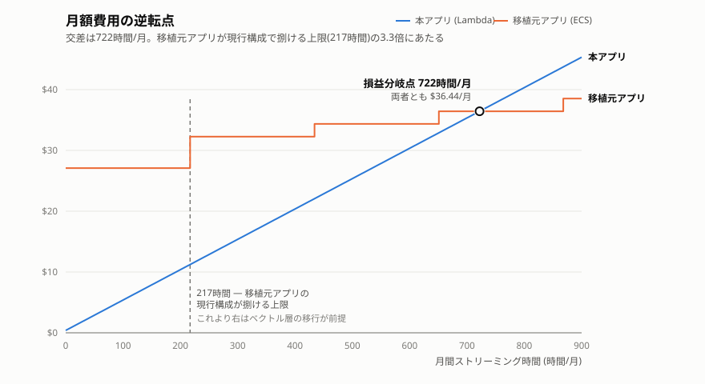

# サーバーレス構成の損益分岐点 — 移植元アプリ(ECS)との比較

本アプリはコスト最適化を理由にECS版からLambda版へ移行した。以下は本アプリと移植元アプリの構成である。

| | 構成 |
|---|---|
| 本アプリ | Lambda(api-fn / chat-fn / ingest-fn), API Gateway, DynamoDB, S3 Vectors。VPC不使用。 |
| 移植元アプリ | ECS Fargate Spot 2タスク(FastAPI / Next.js, 各0.25vCPU・0.5GB)を平日9時から19時に稼働。RDS MySQL(db.t4g.micro), Chroma on EFS |

本ドキュメントでは、損益分岐点と導出を簡単に説明する。

## 1. 結論

月間ストリーミング時間が722時間を下回る場合は本アプリが移植元アプリより安くなる。1チャット30秒とすると、約86,600チャットである。



移植元アプリの費用はFastAPIのタスク数を1つ増やすごとに増加し、本アプリの費用は月間ストリーミング時間に対して直線的に増加する。

また、移植元アプリはベクトルDBとしてChromaをファイルで使用しており、FastAPIを複数タスクにすると同時書き込みが発生する。そのためFastAPIのタスク数2以上ではChromaのサーバー移行が必要であり、その費用も移植元アプリ側に含めている。

## 2. 費用モデル

本アプリと移植元アプリの費用モデルを示す。費用は支配項のみを抽出している。

### 2.1 本アプリ(Lambda版)

```text
A(N) = (c·T + m)·N + s + l·N
```

- `c` … chat-fnのインフラにかかる実行時間単価。$1.33334e-5/GB秒(arm64)にメモリ1.0GB(1024MB)を掛けた$1.33334e-5/秒
- `T` … 1チャット当たりのストリーミング時間。30秒とする
- `m` … 1チャット当たりのAPI Gatewayとapi-fnの費用。$1.6e-5
- `s` … 本アプリの固定ストレージ費。約$0.4/月
- `N` … 月間チャット数
- `l` … 1チャット当たりの外部API費用

この30秒は本番環境の実測に基づく。chat-fnのログに残るチャット8回では、ストリーム時間が6.5秒から20.1秒(平均12.1秒)、課金対象のBilled Durationが6.5秒から32.2秒(平均21.1秒)であった。差はコールドスタートによるもので、8回のうち6回がコールドスタート、うち4回ではコンテナイメージの初期化が10秒の初期化フェーズ上限に達し、超過分がinvoke側のDurationへ計上されている。低頻度の利用では大半の呼び出しがこの経路を通るため、Tにはストリーム時間の平均ではなく、Billed Durationの平均を上回る30秒を採る。

`m`は、1チャットがAPI Gatewayへ3リクエスト(SSEが1件、チャット一覧と詳細の取得が2件)を発生させ、そのうちapi-fnが処理する2件を512MBで200msとして求めた。リクエスト課金とapi-fnの実行時間を合わせて$1.6e-5となる。

### 2.2 移植元アプリ(ECS版)

```text
B(N) = F(n) + l·N
```

- `F(n)` … FastAPIのタスク数をn台にしたときの月額インフラ費用

F(n)の内訳は以下となる。

```text
F(n) = 22.91 + 2.088 × (1 + n) + 3.09   (n ≥ 2)
F(1) = 22.91 + 2.088 × 2                (n = 1)
```

固定費$22.91/月は負荷に依らず発生し、内訳は下記のとおりである。

| 項目 | 月額 |
|---|---:|
| RDS db.t4g.micro($0.025 × 730時間) | $18.25 |
| RDS gp2ストレージ(20GB) | $2.76 |
| EFS | $1.00 |
| その他固定(Secrets Manager、ECR、ログ) | $0.90 |
| 合計 | $22.91 |

n ≥ 2でのみ加わる$3.09/月は、Chromaをサーバーモードへ移すための専用タスク(0.5vCPU・1GB)とそのパブリックIPv4の費用である。

増設単位$2.088/月は、ECSのタスク数を1つ増やすときに実際に増えるリソース費用である。チャットを処理するFastAPIタスクは増設する一方でSSEをパススルーするNext.jsタスクは1台のまま使用可能。

| 項目 | 月額 |
|---|---:|
| Fargate Spot 1タスク(0.25vCPU・0.5GB、217時間) | $1.003 |
| パブリックIPv4アドレス 1個(217時間) | $1.085 |
| 合計 | $2.088 |

F(n)の値は以下となる。

| n | 構成 | F(n) |
|---:|---|---:|
| 1 | 現行構成(FastAPI 1台 + Next.js 1台) | $27.09 |
| 2 | FastAPI 2台 + Chromaサーバー | $32.26 |
| 3 | FastAPI 3台 + Chromaサーバー | $34.35 |
| 4 | FastAPI 4台 + Chromaサーバー | $36.44 |

### 2.3 タスク数とストリーミング時間の関係

月間ストリーミング時間`S`(時間/月)は、月間チャット数`N`と1チャットのストリーミング時間`T`(秒)から`S = N × T ÷ 3600`で定まる。T = 30秒では`N = 120 × S`となる。`F(n)`のnはこのSから決まる。FastAPI 1タスクが同時に処理するストリームを1本と仮定すると、1タスクが1か月に捌ける量は稼働時間と同じ217時間となり、必要なタスク数は次のようになる。

```text
n = ceil(S / 217)
```

この仮定を緩めても分岐点が動く幅は限られる。詳細は3章に記す。

### 2.4 変数と単価

前に述べた損益分岐点は、2.3で定めた月間ストリーミング時間`S`の1変数で定まる。

理由は2つある。
1. `A(N) = B(N)`となるNを求める際、両式へ同額で加算される`l·N`は打ち消し合う。つまり、損益分岐点はインフラ費用のみで決まる。
2. Tを30秒に固定したためNとSは相互に換算でき、移植元アプリに必要なタスク数も2.3のとおりSから決まる。

以下は単価(東京リージョンの値)であり、AWS Price List APIの地域別インデックスより引用した。取得日は2026/8/18で、末尾2行のみ2026/8/21である。

| 項目 | 単価 |
|---|---|
| Lambda 実行時間(arm64) | $0.0000133334/GB秒 |
| Fargate(x86) | $0.05056/vCPU時 + $0.00553/GB時 |
| パブリックIPv4アドレス | $0.005/時 |
| RDS db.t4g.micro(MySQL、Single-AZ) | $0.025/時 |
| RDS gp2ストレージ | $0.138/GB月 |
| API Gateway REST APIリクエスト | $4.25/100万リクエスト |
| Lambda リクエスト | $0.20/100万リクエスト |

Fargate Spotの価格は変動し、Price Listに含まれないため、オンデマンド比70%引きを仮定する。また、EFSとSecrets Managerは非支配項であり、移植元アプリでの月額をそのまま用いる。

### 2.5 損益分岐点の導出

`A(N) = B(N)`をSについて解く。T = 30秒より`N = 120 × S`となるため、本アプリのインフラ費用は1時間当たり`(c·T + m) × 120 = $0.04992/時`となる。

```text
0.04992 × S + 0.4 = F(n)
```

移植元アプリ側は`n = ceil(S / 217)`で階段状に増えるので、Sの帯ごとにF(n)を当てはめて交差を探す。交差はn = 4の帯にあり、`F(4) = $36.44`である。

```text
S = (36.44 - 0.4) ÷ 0.04992 = 721.9
```

分岐点は722時間/月、T = 30秒では約86,600チャット/月となる。これは移植元アプリが現行構成で捌ける上限217時間の3.3倍にあたる。

### 2.6 費用モデルで無視する項

支配項のみのモデルとするため、非支配項である以下の項目を落とした。

- ingest-fnの実行時間とリクエスト課金。取込はチャット数に比例しない
- DynamoDB、S3、S3 Vectors、ECRの読み書き課金
- 無料枠に収まる範囲のSQS、CloudWatch、X-Ray、SNS、CloudFront、Cognito
- 移植元アプリ側のECR、CloudWatch Logs、RDSバックアップストレージ、EFSのスループット課金、データ転送

Lambdaの無料枠(400,000 GB秒/月)は無視できないが、適用条件がAWSアカウントにより変わるため考慮しない。

## 3. 前提と見直し条件

**FastAPI 1タスクが同時に処理するストリームは1本と仮定している。** 実際には非同期のFastAPIがLLMの応答を待つ間に他のストリームを処理できるため、この仮定は移植元アプリに不利な側へ働く。ただし1タスクがk本を同時に捌けるとしても、減るのは必要なタスク数`ceil(S / 217k)`だけであり、移植元アプリの費用が固定費を含む`F(1) = $27.09`を下回ることはない。そのため`(27.09 - 0.4) ÷ 0.04992 = 535時間/月`が分岐点の下限となり、同時実行の仮定によらず535時間から722時間の帯に収まる。

**Tを30秒に固定している。** 1時間当たりのチャット数はTで決まるため、Tが短いほど`m`の比重が上がり分岐点は下がる。ストリーム時間の実測平均に近いT = 12秒では683時間となる。逆にTが長いほど`m`の比重は下がり、分岐点は751時間へ漸近する。

**トラフィックは稼働時間内で均等に分布すると仮定している。** 移植元アプリが必要とする同時実行数は実際の分布に依存する。ピークがあれば必要なタスク数は増えるため、この仮定は移植元アプリに有利な側へ働く。

**Fargate Spotの割引率は仮定である。** オンデマンド比70%引きとしているが、50%引きだった場合は `F(n)` が約$4.7上がり、分岐点は約13%増加する。

**単価は取得時点の値である。** AWS Price List APIの地域別インデックス(`https://pricing.us-east-1.amazonaws.com/offers/v1.0/aws/<サービス>/current/ap-northeast-1/index.json`)を引用した。

## 関連ドキュメント

- [ADR-0001: サーバーレス構成による固定費ゼロ方針](./adr/0001-serverless-zero-fixed-cost.md)
- [ADR-0005: ベクトルDBにS3 Vectorsを採用](./adr/0005-s3-vectors.md)
- [システム設計書 11. コスト](./architecture.md#11-コスト)
